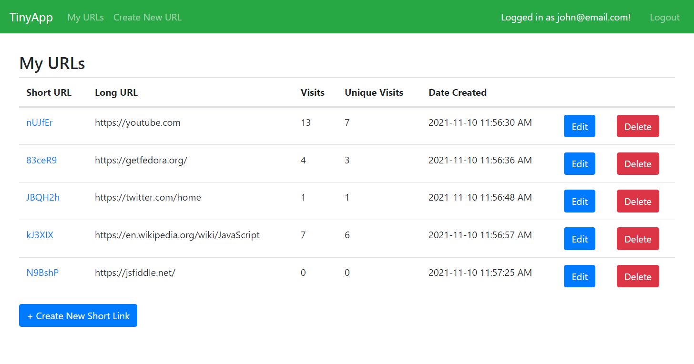
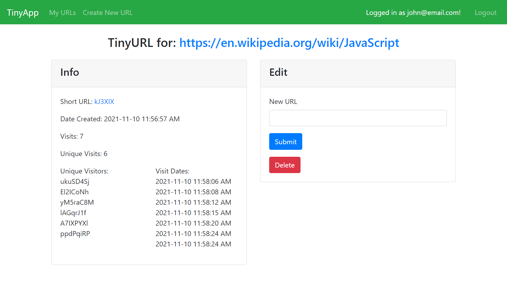

# TinyApp Project

TinyApp is a full stack web application built with Node and Express that allows users to shorten long URLs (à la bit.ly).

## Final Product

## Dependencies

- Node.js
- Express
- EJS
- bcrypt
- body-parser
- cookie-session
- Day.js

## Getting Started

- Install all dependencies with `npm install`
- Run the development web server with `node express_server.js`
